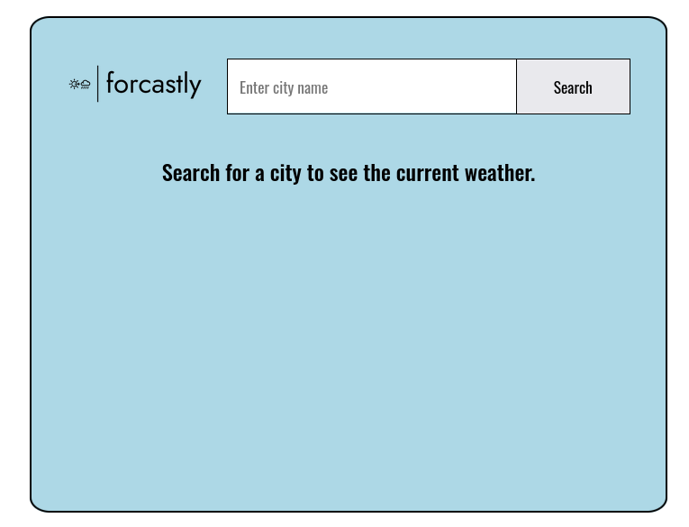
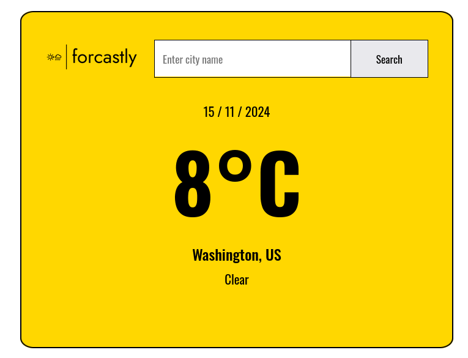
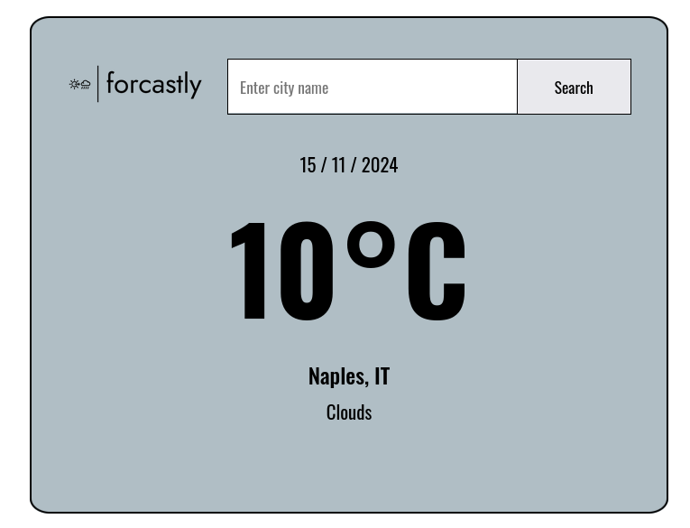

Here’s a simple and clear README for your weather app:

---

# Weather App 🌦️

A simple weather application built with React.js. Enter a city name, and it displays the current weather, including temperature and conditions.  

## Features
- Search for any city to get the current weather.
- Displays:
  - City name along with the country code.
  - Current temperature in Celsius.
  - Weather condition (e.g., Clear, Rain, Snow).
- Dynamic background color based on weather conditions.

## How to Use
1. Clone the repository:
   ```bash
   git clone https://github.com/SamirTaous/weather-app.git
   ```
2. Navigate to the project folder:
   ```bash
   cd weather-app
   ```
3. Install dependencies:
   ```bash
   npm install
   ```
4. Start the application:
   ```bash
   npm start
   ```
5. Open your browser and go to `http://localhost:3000`.

6. Type a city name in the search bar, click "Search," and view the current weather for that city!

## Technologies Used
- **React.js**: Front-end library for building user interfaces.
- **OpenWeatherMap API**: Provides weather data.

## API Key
This app uses the [OpenWeatherMap API](https://openweathermap.org/). Replace the placeholder API key in the code with your own:
```js
const apiKey = 'your-api-key';
```

## Screenshots





## License
This project is open-source and available under the [MIT License](LICENSE).

---
